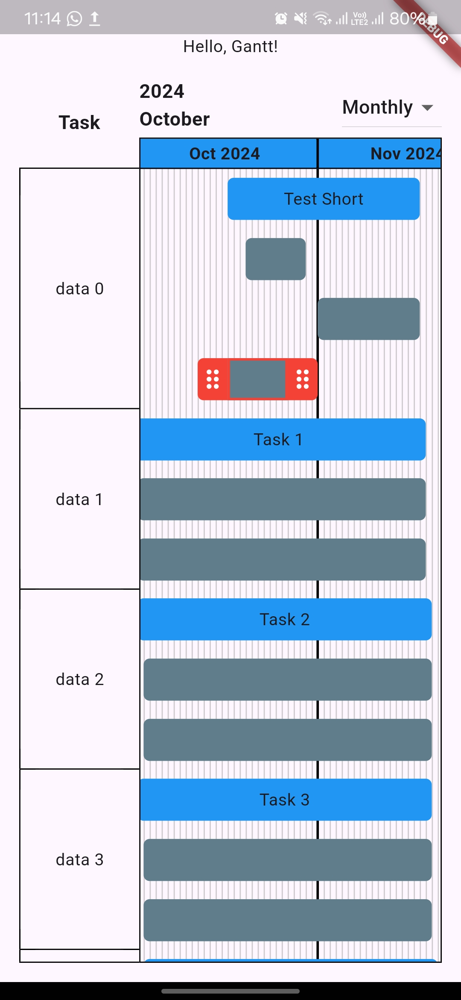

# Interactive Gantt Chart

Note: This package is still in very early development and is might not yet ready for use.

A Flutter package to create interactive Gantt charts. This package allows you to visualize and interact with Gantt charts, including features like scrolling, dragging, and dynamic updates.

## Features

- Display tasks with start and end dates
- Scrollable and draggable tasks
- Dynamic updates to task dates
- Customizable task labels and styles